
<h1>House Price Prediction</h1>

<h3>Machine Learning Final Project</h3>

Zikun Qian, N15544629

Zhong Wang, N12413140

Chenxi Cheng, N17666649

Sanyang Yang, N18678343

Github: https://github.com/ChenxiiCheng/ML-Final

### Topic Selection

At first, we find and come up with some interesting topics, shown below:

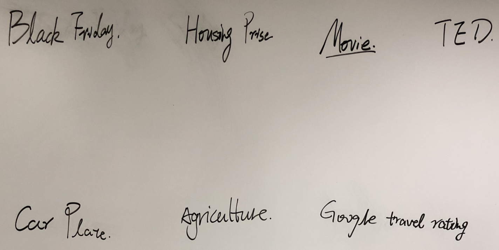

After discussion, we selected the Housing Price Prediction as the final topic. As a popular and familar topic, it has abundant resources we can refer to online. Then we filtered some relevant features according to the data set.

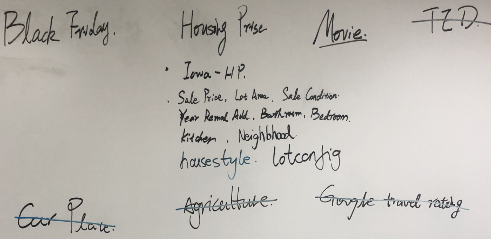

#### General Procedure

* Data visualization. Select some features manually from the data and visulize the data to get an intuitive recogtion of the data set.
* Data preprocessing. Do preprocessing like normalization and filling in the blank on the data to improve the validation accuracy.
* Model selection. Try to use some models we studied or from external resources to train the data, and use K-fold validation methods to evaulate the error on the test data to select the best model.
* Evaluate the model. Select the best model and retrain the model with some extreme value removed to check whether it imporves the performance.

#### Data Visualization

We selected 9 features that are most relevant to house price from on data set, including `bedrooms`, `bathrooms`, `sqft_lot`, `floors`, `waterfront`, `condition`, `grade`, `sqft_above`, `sqft_basement`.

1.**Distribution**.

 For every feature, we first compute each distinct value and the number of samples equal to the value in the training data.If there are no more than 20 distinct values, we plot a line graph, otherwise we plot a histogram with 20 blocks. This gives us an intuitive distribution of the feature.

2.**Correlation with the price**. 

For every feature, we plot a scatter graph showing the feature value and the price. Usually all features are in the positive correlation with the price attribute. We can briefly draw a conclusion from the graph which feature has more weight in deciding the price.

3.**Correlation of each feature**. Calculate and plot the heap map of each pair of attributes. And may exclude the features with the least correlation with the price in future training.

#### Data process

As we know, the data acquired online usually have many null values,  so it's necessary to preprocess the data so that the final prediction will have a better performance. Measures are as listed:

1. Eliminate  the whole data row if there is any null value exist,
2. Replace the null value with the mean value of a certain feature.

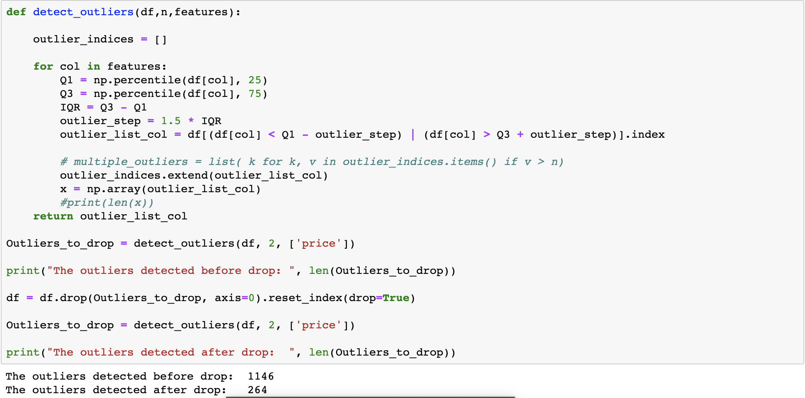

##### Analyse 

Since there are more than 10k samples in the original data, it would not hurt the whole integrality if the incomplete data is less than 5%,  however, if there are too many samples to be eliminated, then the second measure will be better for it can suit the major part of data except for some outliers and it won't cause problems for reducing the sample size.

We selected the first one because of its perfect data integrality.

However, after the preliminary data process, a problem still exists. Some of the samples with extreme feature values, are too rare in the graph to consider as the training sample, but still affect the whole prediction, so it is necessary to eliminate these outliers and then to train these sample. The specific removal method is shown above.

As the price is most significant, we detected some outliers in 'Price',  remove them, and then train the data again and again until we find the best outlier_step, which decides the range of removal.
After removing these outliers, we obtained a better prediction, with 4% improvement, compared with the first beginning. 

Besides, there are so many features we need to consider, which may not be that relevant, so we thought it should have a better performance if we remove certain less relevant features, and pay more attention to those main influential features.
Then we tried to remove the last 2 features,'sqft_lot' and 'condition' according to the heatmap. To our surprise, even though it has low relation to the price, after removing these 2 features, we didn't get what we want, the final R2_score is a little bit lower than before. So we kept our old way.

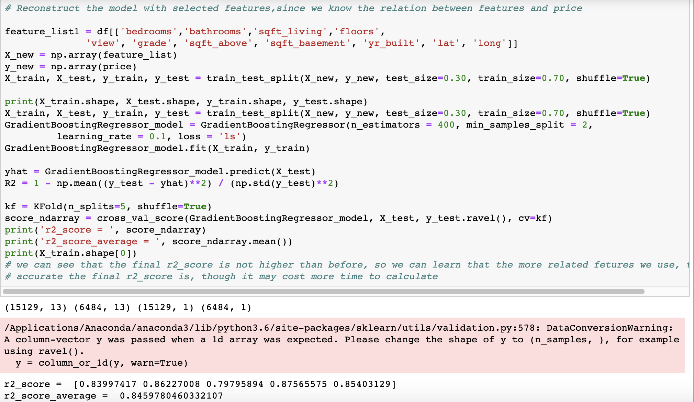

**Model selection, training, and prediction **

In this project, we use each of following method to instantiate the model object. After that, use the model to predict yhat and KFold to instantiate cross validation object. Finally, we choose cross_val_score method for cross validation. We judge the fitness of the model by calculating the value of R2. Usually, the closer the value is to 1, the better the effect.

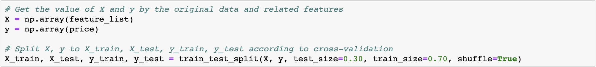

1. **Linear Regression Model**

   The first model is linear regression model. Linear regression can describe the relationship between data accurately with a straight line. In this way, when new data emerges, a simple value can be predicted. Linear regression is often used in house price forecasting. Linear Regression have a fast Modeling speed, it does not need very complicated calculation. Also, Each variables can be understand and explained according to the coefficients. Besides these, It is sensitive to outliers.

   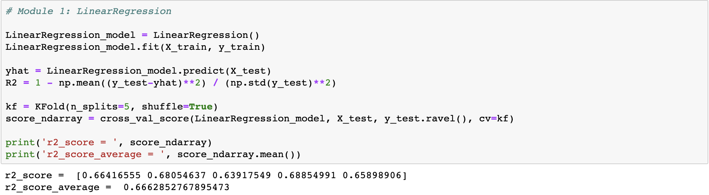

   

2. **Decision Tree Regression Model**

   The second model is decision tree regression model. Decision tree is a common non-parametric supervised learning method for classification and regression. The goal is to create a model to predict the value of target variables by deducing simple decision rules from data characteristics. It is a module that simple and easy to understand, and the number structure can be visualized. Also, It can deal with multi-output problem.

   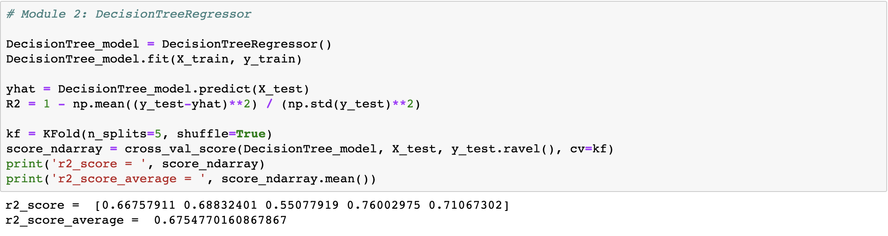

   

3. **Random Forest Regression Model**

   For Random Forest Regressor, it is a random forest regressor, and fits a number of classifying decision trees on various sub-subsample of the dataset and uses averaging to improve the predictive accuracy and control over-fitting. This regressor will randomly choose features to predict, which will probably be a potential problem. It have a fast training spped of random forest algorithm, and random forest algorithms acan be applied to many type of model tasks.

   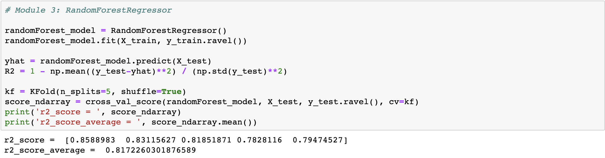

   

4. **Extra Tree Regression Model**

   ExtraTreeRegressor module is an extra-trees regressor, and this class implements a meta estimator that fits a number of randomized decision trees on various sub-samples of dataset. This estimator wouldn't pick features randomly, it will randonly collect part of feature and then use entropy information to find the best/most important sum-sample features.

   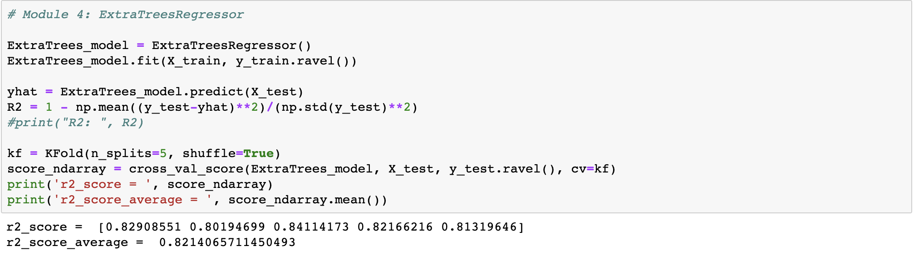

   

5. **Gradient Boosting Regression**

   We also use the GradientBoostingRegressor method to instantiate the model object. Then, use the model to predict yhat and use KFold method to instantiate cross validation object. Finally, use the cross_val_score method for cross validation. We judge the fitness of the model by calculating the value of R2. Usually, the closer the value is to 1, the better the effect.

   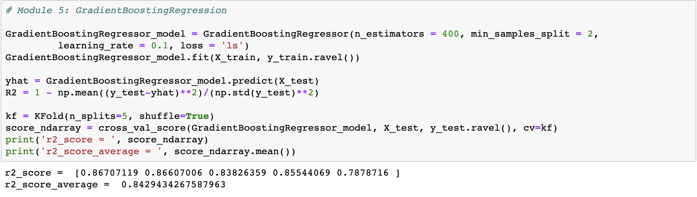

   

#### Cost performance evaluation

One of the meaning to do this project, since people all would like to buy a cost-effective house, it 's necessary to evaluate the house price according to the model, then we built a CP function,
as long as input the basic features, then compare the predicted price with the actual price, it will tell you the cost performance 
with a specific value. In the future, with more data acquired and modify the model, we would get a more accurate evaluation.

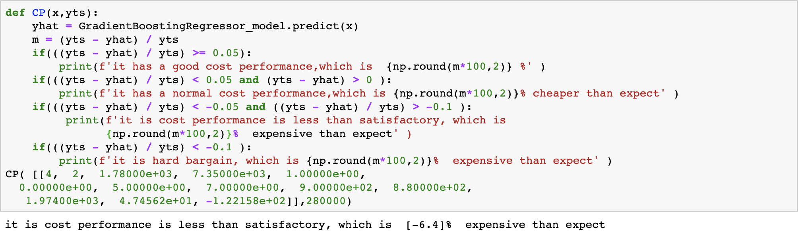

<h4>Summary</h4>

According to the above experiment data, we first visualize the data set, and get the distribution map, correlation graph and thermodynamic diagram, then use function `detect_outliers` to detect and eliminate the extreme value. 

After that, we reasearch and decide to use five different kinds of models to train and predict: `Linear Regression` model, `Decision Tree Regression` model, `Random Forest Regression` model, `Extra Tree Regression` model, and `Gradient Boosting Regression` model. After we use cross-validation and K-fold method, we find out that Gradient Boosting Regression model have the highest accuacry, which is close to 85%. 

Finally, we creat a Cost Performance Evaluation function, it can predict and compare with the cost performance and house price, which is helpful for people who want to buy a cost-effective house. We hope our project can help more people when they are looking for a perfect home.